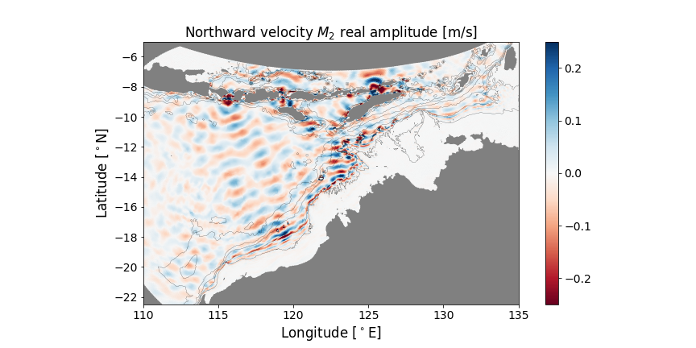

# Internal wave atlas for Northern Australia		

Python toolbox to visualise and extract predictions of internal tide-related quantities including:

 - sea surface height perturbation
 - eastward and northward baroclinic velocity
 - isotherm displacement amplitude
 - vertical density stratification
 
Predictions can be a single point in time and space or many points.

Potential uses:
 
  - SSH to compare with altimetry
  - Derive boundary and initial conditions for a KdV-type internal wave model
  - Extract baroclinic velocity boundary conditions for a regional ocean model

---

# Tutorials 

An interactive tutorial is available to play with on binder:

A more thorough overview of the tools are available in this notebook:

(Note that the [binder](https://mybinder.org/) computing instance will likely run out of memory for this example.)

There are a number of less-polished example/testing notebooks in the [sandpit](./sandpit/).

# Installation

Local development version:

`git clone https://github.com/mrayson/iwatlas`

`pip install -e .`

Using pip:

`pip install git+https://github.com/mrayson/iwatlas.git@master`

# Documentation

TBC. Use the [tutorials](./sandpit/) as a guide for now.

## Downloads

 - The data is available [here in a netcdf file](https://cloudstor.aarnet.edu.au/plus/s/vdksw5WKFOTO0nD).

## Background

 - The original code to generate the atlas from SUNTANS output is in [this repository](https://bitbucket.org/arcoffhub/suntans-nws/src/master/)

 - A paper has been submitted to *JGR-Oceans* outlining the harmonic model details. A [preprint is here](https://www.essoar.org/doi/10.1002/essoar.10504834.1)
  

---

Matt Rayson

University of Western Australia

July 2019
